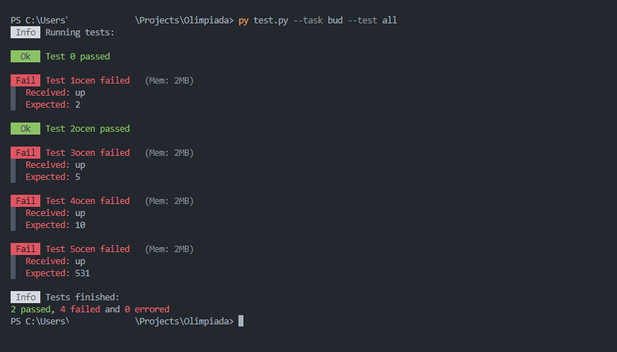

# Tester OI
Szybko i wygodnie przetestuje swoje rozwiązania do olimpiady informatycznej w pythonie.

## Użycie
1. Sklonuj to repozytorium, lub pobierz i rozpakuj [archiwum najnowszej wersji](https://github.com/fajfaj1/tester-oi/releases).
2. W folderze 'rozwiazania' umieść swoje rozwiązania (nazwy plików powinny być takie jak w kryteriach zadani).
3. Uruchom skrypt `test.py` (testowany na wersji Pythona 3.11.0)
> ```bash
> py test.py --task [NAZWA ZADANIA] --test [NUMER TESTU/all]
> ```

Wyniki testów powinny zostać wyświetlone w następujący sposób:


### Zużycie pamięci
Przy każdym teście wyświetli się także zużycie pamięci przez twoje rozwiązanie (w MegaBajtach). Jest on kalkulowany przy użyciu biblioteki [psutil](https://pypi.org/project/psutil/) i nie ręczę za jego poprawność. 

### Pomiar czasu
Czas wykonywania każdego testu ma tylko charakter orientacyjny. Jest mierzony najprostszą możliwą metodą, która nie pokrywa się ze sposobem mierzenia czasu w SIO.

### Konfiguracja
W pliku `config.py` możesz doprecyzować komendę startującą skrypt rozwiązani (domyślnie `py`)

## Ocen
Ten skrypt działa w oparciu o niezmodyfikowane archiwum `/ocen` (dostępne w sekcji Pliki i Testy w SIO). W razie aktualizacji tego pliku, lub chęci użycia innego składu testu, możesz śmiało podmienić ten folder na nowy.

## Błędy i Propozycje
Jeśli natrafisz na jakiś błąd, lub przyjdzie ci do głowy jakieś ulepszenie, zachęcam do pisania w [Issues](https://github.com/fajfaj1/tester-oi/issues) i wysyłania swoich [Pull requests](https://github.com/fajfaj1/tester-oi/pulls).

> Jeśli dotarłeś tak daleko, to zachęcam do zostawienia gwiazdki przy tym repozytorium. Dzięki!